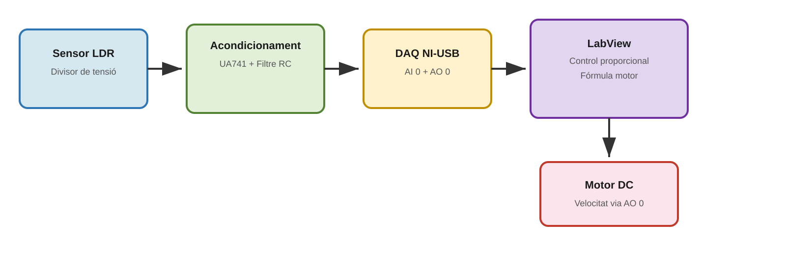
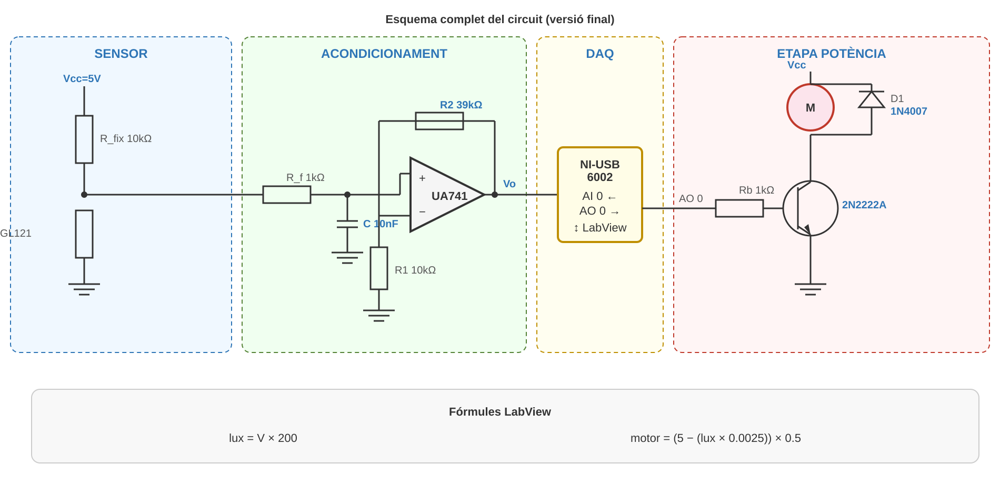
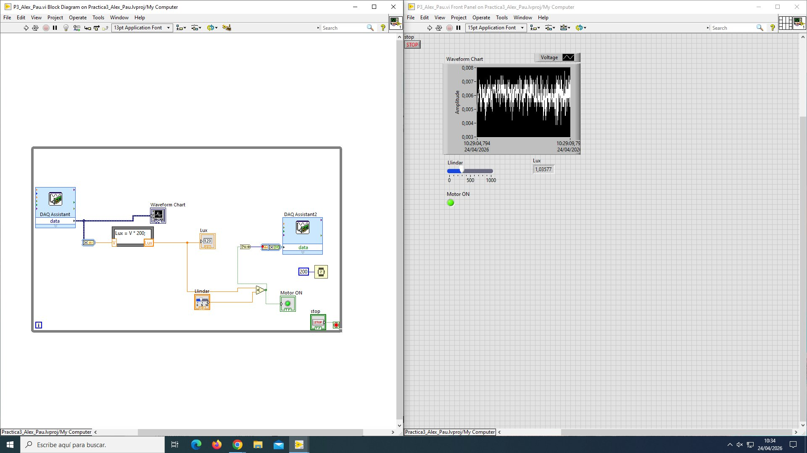
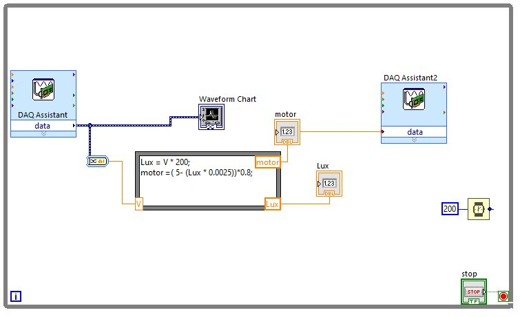
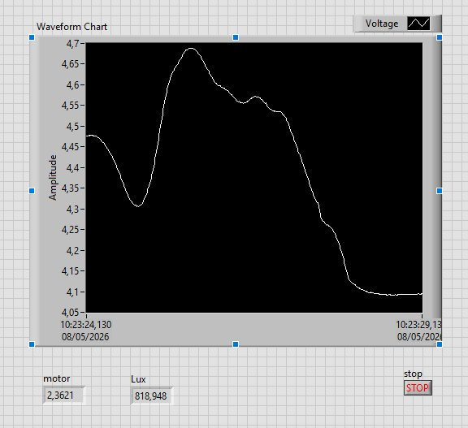
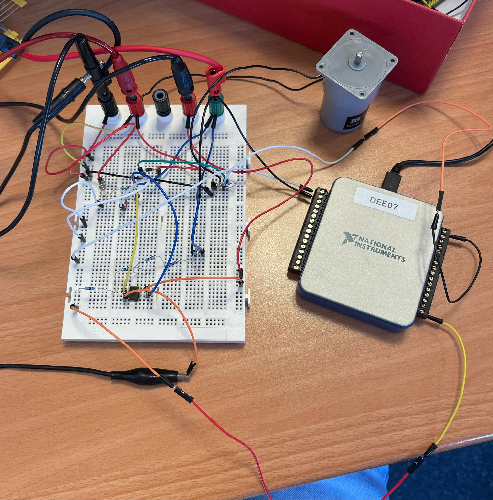
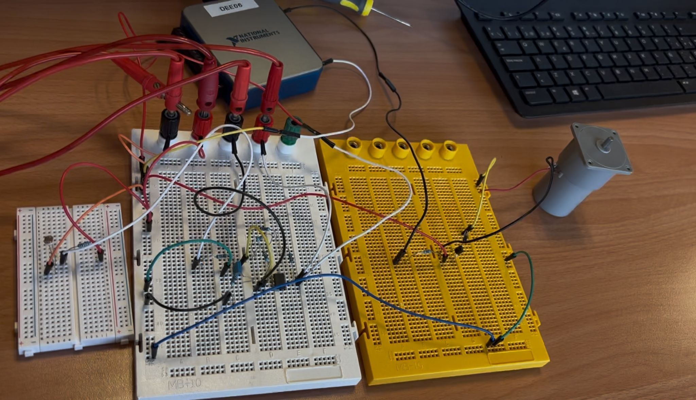
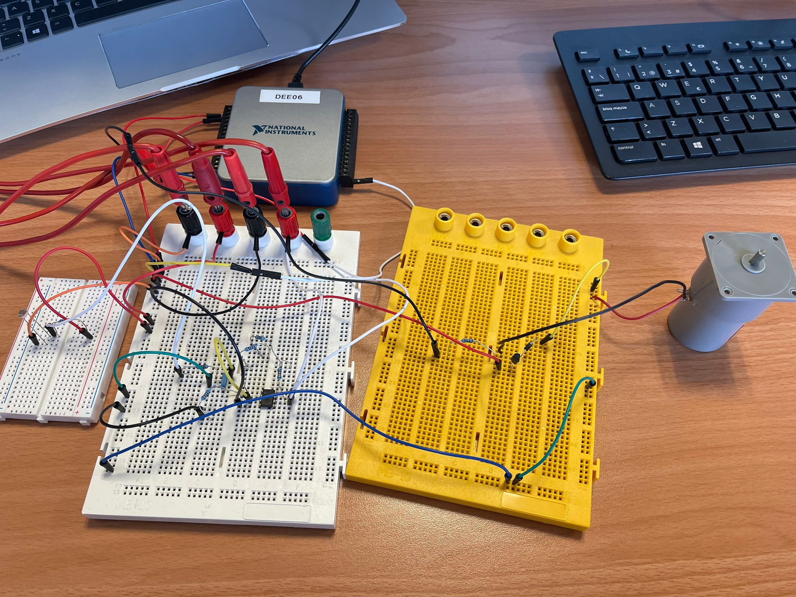

# Digital Luxmeter with Automatic Lighting Control

> Instrumentation system that measures light intensity in real time and controls a DC motor speed proportionally to the detected light level.

**Course:** Instrumentation Lab II  
**Degree:** Electronic Telecommunications Engineering  
**Lab 3:** Design and implementation of an instrumentation system

---

## Demo

- [ON/OFF Motor Control](https://youtu.be/LvDELObPzaY)
- [Proportional Motor Control](https://youtu.be/pPeB20aZNMQ)

## Description

The system uses a light sensor (LDR) to measure ambient luminosity, processes the signal through a conditioning circuit (amplifier + filter), digitizes the data with a NI-USB-6002 DAQ board, and controls a DC motor speed proportionally from LabView.

The project evolved across lab sessions:
- **Version 1:** ON/OFF control with configurable threshold (digital output P0.0)
- **Version 2:** Proportional control with variable speed (analog output AO 0)

## System Architecture



The system follows the architecture: **Sensor → Conditioning → DAQ → LabView → Actuator**

## Circuit Schematic



### Main Components

| Component | Function | Source |
|-----------|----------|--------|
| LDR GL121 AP02 | Light sensor | Lab equipment |
| UA741CP | Non-inverting amplifier (G≈4.9) | Lab equipment |
| R_fix 10kΩ | Voltage divider | Lab equipment |
| R1 10kΩ, R2 39kΩ | Amplifier gain | Lab equipment |
| R_f 1kΩ, C 10nF | RC filter (fc≈16kHz) | Lab equipment |
| 2N2222A | Switching transistor (motor) | Student-provided |
| 1N4007 | Motor protection diode | Student-provided |
| DC Motor 336-321 | Actuator | Lab equipment |
| NI-USB-6002 | Data acquisition board | Lab equipment |

### DAQ Connections (NI-USB-6002)

```
Breadboard           DAQ Board
──────────           ─────────
Vo (pin 6 UA741)  → AI 0
GND breadboard    → AI GND
AO 0              → Rb (1kΩ) → Transistor base
AO GND            → GND breadboard
```

## LabView Program

### Version 1: ON/OFF Control


### Version 2: Proportional Control (final)


### Control Formulas

```
lux = V * 200;
motor = (5 - (lux * 0.0025)) * 0.5;
```

- `V` → voltage read from AI 0
- `lux` → approximate luminosity value
- `motor` → output voltage to AO 0 (0–5V)
- More light → motor spins faster | Less light → motor spins slower

### Block Diagram Structure

```
[DAQ Assist AI0] → [Waveform Chart]
       ↓
   [From DDT]
       ↓
 [Formula Node] → lux → [Lux Indicator]
       ↓
     motor → [To DDT] → [DAQ Assist AO0]

All inside a WHILE LOOP with Wait 200ms and STOP button
```

### DAQ Assist Configuration

- **DAQ Assist 1 (read):** Acquire Signals → Analog Input → Voltage → ai0 → 1 Sample On Demand
- **DAQ Assist 2 (write):** Generate Signals → Analog Output → Voltage → ao0 → 1 Sample On Demand

## Results

| Condition | Lux (approx.) | Motor (V) | Speed |
|-----------|---------------|-----------|-------|
| Sensor covered | ~2000 | 0 | Stopped |
| Lab ambient light | ~800 | ~2.4 | Medium |
| Direct phone light | ~300 | ~4.3 | Fast |



## Lab Photos

### Session 1

*Initial setup on a single breadboard. A short circuit was detected that could not be resolved.*

### Session 2 — ON/OFF System

*Strategy of 3 separate breadboards: sensor, amplifier, and power stage.*

### Session 2 — Proportional System (final)

*Final system with proportional control implemented.*

## Troubleshooting

| Problem | Cause | Solution |
|---------|-------|----------|
| Power supply trips | Short circuit on breadboard | Separate into 3 breadboards |
| Motor always at full speed | Transistor saturating | Adjust formula with ×0.5 factor |
| Motor not spinning | Rb 10kΩ too high | Switch back to Rb 1kΩ, limit via formula |
| LabView type errors | Dynamic Data vs scalar | Add From DDT / To DDT blocks |
| Motor formula > 5V | Bad lux→voltage scaling | Adjust scale factors |

## Repository Structure

```
luximetre-digital/
├── README.md
├── LICENSE
├── .gitignore
├── circuit/
│   ├── esquema_complet.svg
│   └── esquema_blocs.svg
└── imgs/
    ├── esquema_circuit.png
    ├── esquema_blocs.png
    ├── sessio1_muntatge.jpeg
    ├── sessio2_onoff.jpeg
    ├── sessio2_proporcional.jpeg
    ├── labview_onoff.png
    ├── labview_proporcional.png
    └── labview_front_panel.png
```

## How to Replicate

### 1. Build the Circuit
Follow the schematic in `circuit/esquema_complet.svg`. We recommend separating into 3 breadboards:
- **Breadboard 1:** Voltage divider (Vcc → R_fix 10kΩ → LDR → GND)
- **Breadboard 2:** RC filter + UA741 amplifier
- **Breadboard 3:** 2N2222A transistor + 1N4007 diode + DC motor

### 2. Connect the DAQ Board
4 wires: Vo→AI0, GND→AI GND, AO0→Rb, AO GND→GND

### 3. Create the LabView Program

1. **New VI:** File → New VI
2. **DAQ Assist (read):** Block Diagram → Functions → Measurement I/O → NI DAQmx → DAQ Assist → Acquire Signals → Analog Input → Voltage → ai0 → 1 Sample On Demand
3. **While Loop:** Functions → Structures → While Loop (wrap everything, add STOP button)
4. **Waveform Chart:** Front Panel → Graph Indicators → Waveform Chart (connect DAQ output)
5. **From DDT:** Functions → Express → Signal Manipulation → From DDT → "Single Scalar" (connect between DAQ and Formula Node)
6. **Formula Node:** Functions → Structures → Formula Node. Input: `V`. Outputs: `Lux`, `motor`. Formula: `Lux = V * 200; motor = (5 - (Lux * 0.0025)) * 0.5;`
7. **Indicators:** Add two Numeric Indicators on Front Panel for Lux and motor values
8. **DAQ Assist (write):** New DAQ Assist → Generate Signals → Analog Output → Voltage → ao0 → 1 Sample On Demand
9. **To DDT:** Functions → Express → Signal Manipulation → To DDT → "Single Scalar" (connect motor output to DAQ Assist AO0)
10. **Wait:** Functions → Timing → Wait (ms) → constant 200

### 4. Run
Power on ±15V (op-amp) first, then 5V (motor), and finally click Run in LabView.

## License

This project is open source for educational purposes. See the [LICENSE](LICENSE) file for details.
